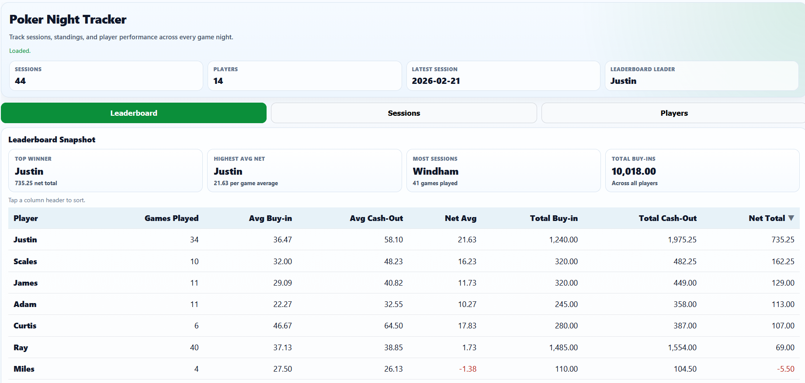
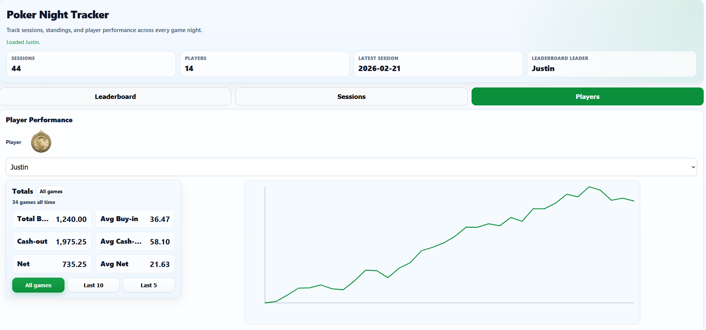

# Poker Night Tracker

A full-stack poker session tracking system built using Google Sheets, Google Apps Script, and a custom mobile-friendly web interface.

## Features

- Leaderboard with filtering (min games threshold)
- Player performance dashboard with:
  - Running profit chart
  - Averages and totals
  - Year-in-review breakdowns
- Session tracking and historical data
- Google Drive integration for scanned game sheets
- Medal system for top 3 players
- Mobile-optimized UI

## Tech Stack

- Google Apps Script (backend)
- Google Sheets (database)
- Vanilla JavaScript (frontend)
- HTML/CSS (UI)
- Google Drive API (image storage)

## Screenshots

### Leaderboard

### Player Profile

### Sessions

## Architecture

- Google Sheets acts as the database
- Apps Script exposes API endpoints
- Frontend calls Apps Script via `google.script.run`
- Drive stores scanned session images

## Notes

This app is deployed via Google Apps Script Web App and is not directly runnable from this repository.

## Live Demo

(Add your deployed web app link here)
